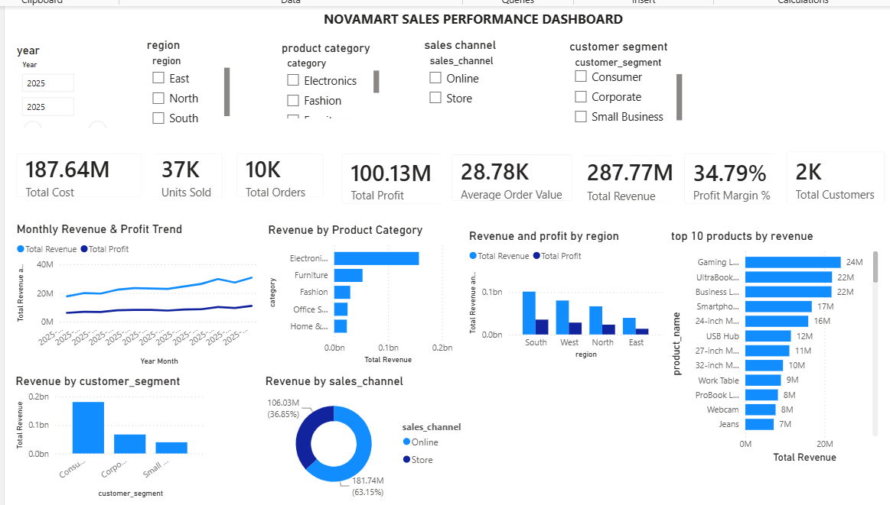

# NovaMart Sales Analytics

## 📊 Project Overview

NovaMart Sales Analytics is an end-to-end Data Analytics project that analyzes sales, customers, products, regions, and profitability using **Python, MySQL, and Power BI**.

The objective of this project is to transform raw sales data into meaningful business insights and an interactive dashboard that can help identify revenue trends, profitable categories, regional performance, customer segments, sales channels, and top-performing products.

---
## 📸 Power BI Dashboard



The dashboard provides an interactive view of NovaMart's sales performance, including revenue, profit, customers, products, regions, sales channels, and monthly trends.

## 🎯 Business Objectives

The project focuses on answering key business questions such as:

- What is the total revenue and profit generated?
- Which product categories generate the most revenue?
- Which categories have the highest profit margins?
- Which regions perform best?
- Which sales channel generates more revenue?
- Which customer segments contribute the most revenue?
- Which products are the top revenue generators?
- How does revenue and profit change month by month?
- What is the average order value?
- How many customers, orders, and units are involved?

---

## 🗂️ Dataset

The project contains four datasets:

### Customers
Contains customer information including:

- Customer ID
- Customer Name
- City
- State
- Customer Segment

### Products
Contains product information including:

- Product ID
- Product Name
- Category
- Sub-Category
- Unit Cost
- Unit Price

### Orders
Contains order-level information including:

- Order ID
- Customer ID
- Order Date
- Region
- Sales Channel
- Payment Method

### Order Details
Contains product-level order information including:

- Order ID
- Product ID
- Quantity
- Discount

---

## 📏 Dataset Size

| Dataset | Records | Columns |
|---|---:|---:|
| Customers | 2,000 | 5 |
| Products | 200 | 6 |
| Orders | 10,000 | 6 |
| Order Details | 19,467 | 4 |

---

# 🐍 Python Analysis

Python was used for data cleaning, validation, exploratory data analysis, KPI calculation, and visualization.

### Libraries Used

- Python
- Pandas
- NumPy
- Matplotlib

### Python Tasks

- Loaded CSV datasets
- Inspected dataset structure
- Checked data types
- Converted order dates
- Checked missing values
- Checked duplicate records
- Validated primary keys
- Validated order-product combinations
- Created a combined sales dataset
- Calculated business KPIs
- Analyzed category performance
- Analyzed revenue and profit trends
- Created visualizations

### Key Python KPIs

- Total Revenue
- Total Cost
- Total Profit
- Profit Margin
- Total Orders
- Total Customers
- Total Products
- Units Sold
- Average Order Value

---

# 🗄️ MySQL Analysis

MySQL was used to perform structured business analysis on the sales database.

### SQL Concepts Used

- SELECT
- WHERE
- GROUP BY
- ORDER BY
- INNER JOIN
- Aggregate Functions
- SUM()
- COUNT()
- DISTINCT
- ROUND()
- CASE
- Date Functions
- Revenue calculations
- Profit calculations

### SQL Analysis Performed

- Revenue by product category
- Profit by product category
- Top products by revenue
- Monthly revenue analysis
- Monthly profit analysis
- Revenue and profit by region
- Order count by region
- Product performance analysis
- Profit margin analysis

---

# 📈 Power BI Dashboard


An interactive Power BI dashboard was created to visualize the results of the analysis.

### KPI Cards

The dashboard includes:

- Total Revenue
- Total Cost
- Total Profit
- Profit Margin %
- Total Orders
- Total Customers
- Units Sold
- Average Order Value

### Visualizations

The dashboard contains:

- Monthly Revenue & Profit Trend
- Revenue by Product Category
- Revenue & Profit by Region
- Revenue by Customer Segment
- Revenue by Sales Channel
- Top 10 Products by Revenue

### Interactive Filters

Users can filter the dashboard using:

- Region
- Product Category
- Sales Channel
- Customer Segment

---

# 📊 Key Business Results

The analysis produced the following overall results:

| KPI | Result |
|---|---:|
| Total Revenue | ₹287.77M |
| Total Cost | ₹187.64M |
| Total Profit | ₹100.13M |
| Profit Margin | 34.79% |
| Total Orders | 10,000 |
| Total Customers | 2,000 |
| Total Products | 200 |
| Units Sold | 36,946 |
| Average Order Value | ₹28,777.38 |

---

# 💡 Key Business Insights

### 1. Electronics is the leading revenue category

Electronics generated approximately **₹157.19M**, making it the highest revenue-generating product category.

### 2. Fashion has the highest profit margin

Fashion achieved approximately **36.36% profit margin**, making it the most profitable category in terms of margin.

### 3. South is the strongest region by revenue

The South region generated approximately **₹101.41M in revenue** and **₹35.21M in profit**.

### 4. West has the highest regional profit margin

The West region achieved approximately **35.00% profit margin**, slightly higher than the other regions.

### 5. Online sales dominate

The Online sales channel contributed approximately **63.15% of total revenue**, compared with approximately 36.85% from Store sales.

### 6. Consumer customers contribute the most revenue

The Consumer segment is the largest revenue-generating customer segment, followed by Corporate and Small Business customers.

### 7. Revenue increased throughout 2025

Monthly analysis showed a strong increase in revenue during 2025, with December reaching approximately **₹30.72M**, compared with approximately **₹17.71M in January**.

---

# 🛠️ Tools & Technologies

| Tool | Purpose |
|---|---|
| Python | Data cleaning, EDA and analysis |
| Pandas | Data manipulation |
| NumPy | Numerical operations |
| Matplotlib | Data visualization |
| MySQL | SQL-based business analysis |
| Power BI | Interactive dashboard |
| DAX | KPI and analytical measures |
| Git/GitHub | Version control and project sharing |

---

# 📁 Project Structure

```text
NovaMart_Sales_Analytics/
│
├── data/
│   ├── customers.csv
│   ├── order_details.csv
│   ├── orders.csv
│   └── products.csv
│
├── python/
│   └── novamart_analysis.py
│
├── sql/
│   └── sales_analysis.sql
│
├── powerbi/
│   └── NovaMart_Sales_Dashboard.pbix
│
├── screenshots/
│   └── dashboard.png
│
└── README.md

## 📌 Key Takeaways

- Electronics is the largest revenue-generating product category.
- Fashion has the highest profit margin among the product categories.
- South is the highest-revenue region.
- West has the highest regional profit margin.
- Online sales contribute approximately 63% of total revenue.
- Consumer customers contribute the largest share of revenue.
- Revenue shows strong growth throughout 2025.